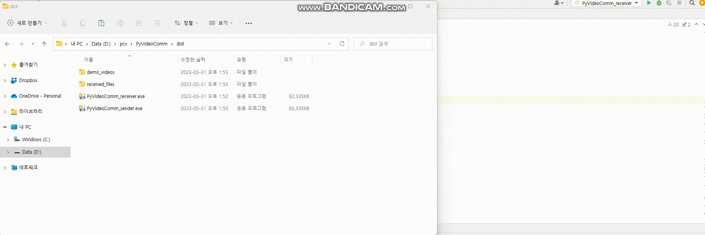

# Python easy Video transfer and Communication (PyVC)

PyVideoComm is basic start code that makes sending and receiving video in two programs(or two PCs) very easily by Python.   You can transfer video files by PyVC easily.

## Overview
PyVideoComm consists of two files: 
PyVideoComm_sender.py and PyVideoComm_receiver.py.

Each file corresponds to a transmitter/receiver and provides a file selection/file save UI. 
The transmitter allows you to select files to send by a UI. 
The receiver allows you to save the received files by a UI.

## User-friendly features
(1) PyVideoComm_sender.py has a "Stop sending" button, so you can stop the transmission of video in the midway. 
(2) PyVideoComm_sender.py and PyVideoComm_receiver.py can send and receive repeatedly(unlimitted). 
(3) PyVideoComm_receiver.py has a display window that shows the received video in real-time.

## Create your own executables.
You may use some Pyinstaller or etc to create executable exe files for the video sender and video receiver.

## Communication between two PCs
By default, the current code assumes that the transmitter/receiver is running on a same PC, but it may be possible to send/receive video from different PCs using TCP/IP as follows.        

* host = 'localhost'  
* port = 5000 

By setting host and port correctly, for e.g., setting the TCP/IP host address and port you will use for communication, it may extend the program to send/receive video from two PCs. 

The UI function that support setting host and port may be updated in the next commit or you could support this git by your pull request.

 
Thanks you.  
NeighborhoodCoding, South Korea.